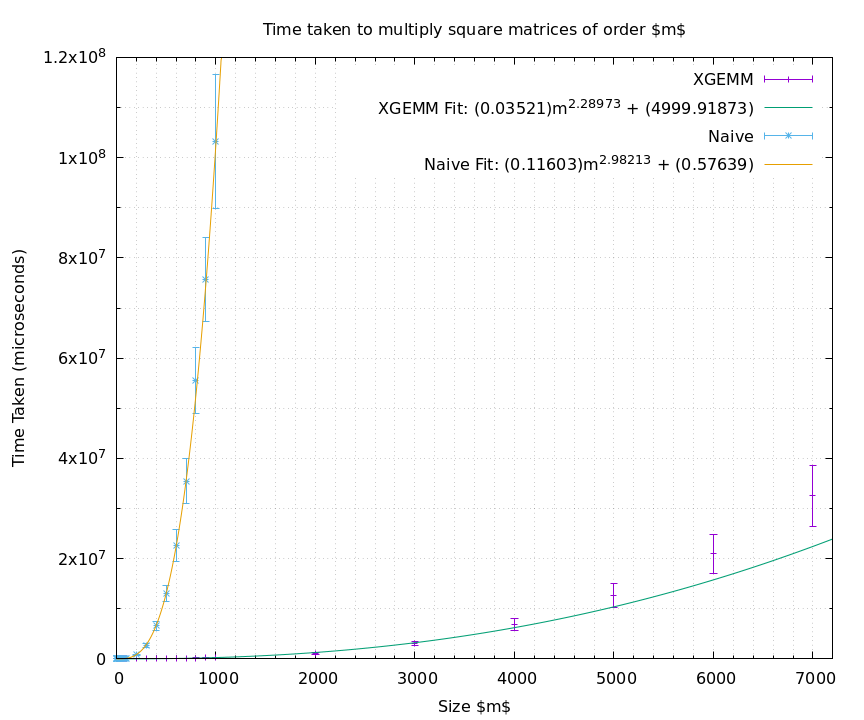
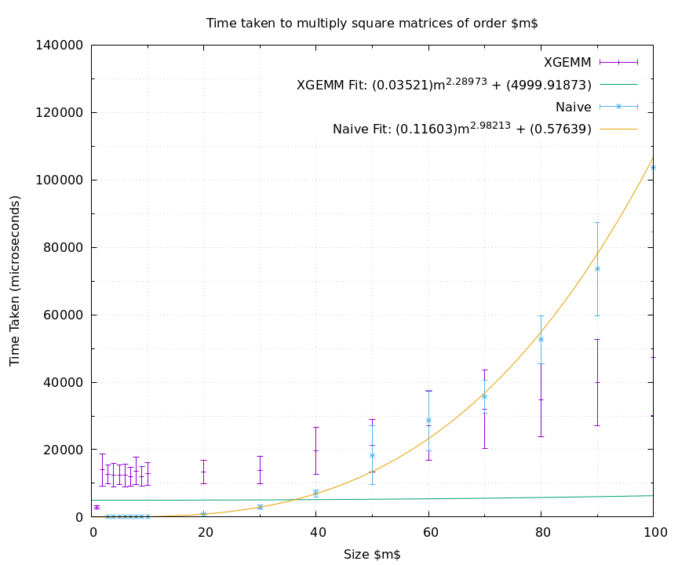

# Problem 2 Implementing fast matrix contractions

## 2.a 
```la_operations::contract``` was fixed by passing the appropriate parameters to `xgemm` function.

See C++ code `test.cpp` for the test case. There, `A` is chosen to be a `2 x 3` matrix and `B` is chosen to be a `3 x 2` matrix. The two matrices are then filled with random integers. The resulting matrix `C = A * B` is then first calculated using the `gemm` wrapper, and then calculated manually using a for-loop. 

If every element matches, then `test` return `0`. Otherwise, it returns `1`. 

Such a test case useful because it helps to check if the wrapper has been implemented correctly, and that we can actually rely on the output that the function returns. Generally, this catches mistakes early on in the development pipeline, reducing debugging time in the future.

## 2.b
The good thing is that we have already implemented the naive matrix multiplication in `test.cpp`, and we can directly use it. We use the same concept as in Problem 1 and make `main` output the two timings. Implementation also follows that of Problem 1, but this time the matrices are filled with random numbers from 0 to $m$.

Strangely, if you run
```
C = A*B
C = A*B // only time this
```
and you only time the second one, it is much faster. I still don't quite understand that though. Maybe it has something to do with caching...



We obtained: 
```
Naive: beta = 2.98
XGEMM: beta = 2.29
```
The naive matrix-multiplication was approximated $O(m^3)$, just like how we expected. XGEMM was significantly faster, approximately $O(m^2.3)$.



However, for very small $m < 40$, it is actually faster to use the naive method. 
